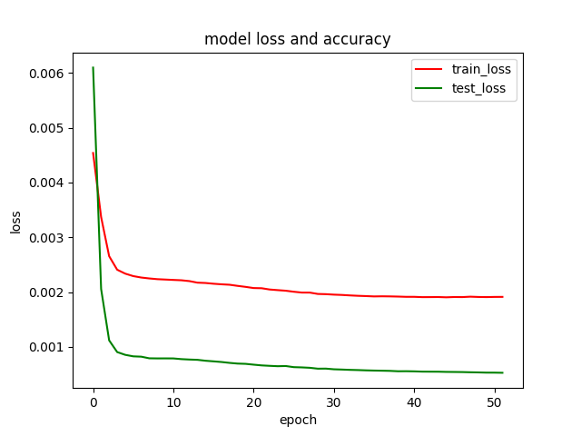

# machine-learning-examples

不同的框架下常见的深度学习模型的例子,主要用来探索框架的使用，并不特别注重模型的结构以及正确性。

## LSTM预测石油价格

[LSTM](keras/lstm) - 使用keras构建LSTM回归模型预测石油价格。

|  
训练情况
 |   数据拟合情况 |
|:------------------------------------------------------:|:------------------------------------------------:|

